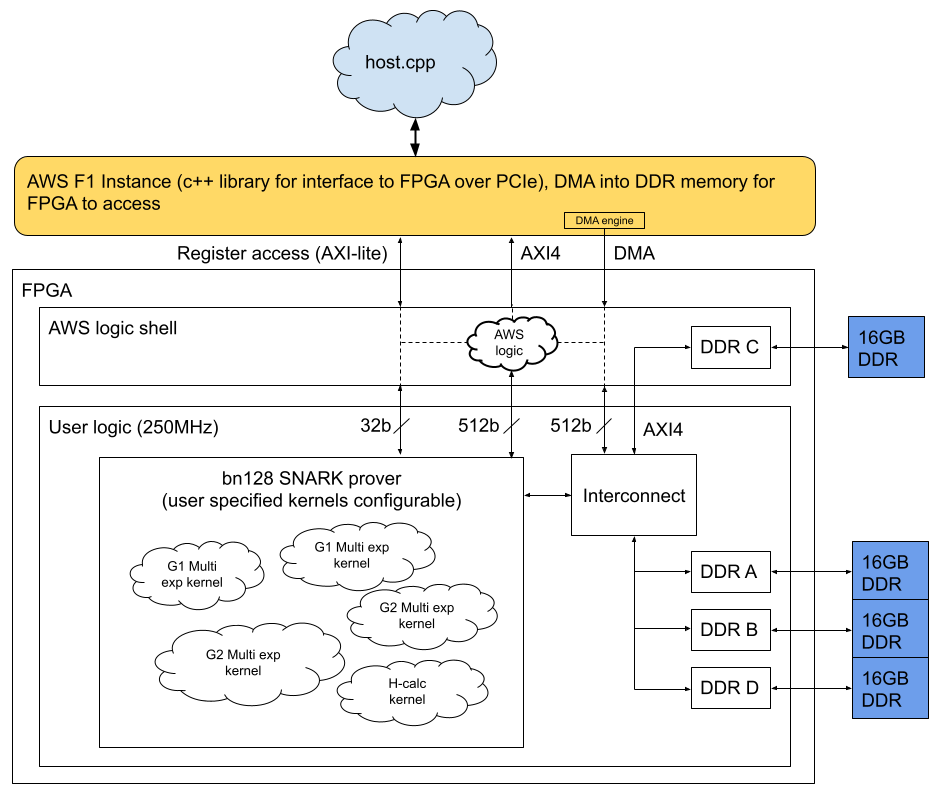

Kernels (RTL)
======================

## Top level ##

This diagram shows the top level view when using the FPGA SNARK prover in a AWS Vitis enviroment. Kernels are designed in RTL (System Verilog), and then "linked" together in a host.cpp file which can then send data via DMA to the DDR banks (total 4 banks, 16GB each) which the FPGA can operate on and then return a result to. The host file allows you to include different combinations of kernels together and specify the data flow in a high level language, without worrying about the underneath RTL implementation.



## Kernels designed ##

Several kernels have been compiled from the RTL code that allows for easy inclusion into a host.cpp file. Multiple kernels can be linked and 
exercised depending on what functionality is needed.
Each kernels operates on DRAM memory on the FPGA, which has 4 DDR banks of 16GB each. When building the kernel will automatically get assigned to a 16GB DDR bank and only able to access that bank - to change this you need to modify the kernel.cdf file.

Each kernel has a **hw_emu** and **hw** makefile targets. 
The **hw_emu** target create a ``build_output/<kernel_name>.xclbin`` file and runs hardware simulation which will verify the design against the host.cpp. This takes around 5min to build.
The **hw** target will build the ``build_output/<kernel_name>.xclbin`` and ``.awsxclbin`` file which is used to create an AFI for use on Amazon AWS F1 instances with real hardware. This takes around 4 hours to build.

For more information please see [here](https://github.com/aws/aws-fpga/tree/master/Vitis). This document goes over the accelerator platform and different configuration settings you can change in the kernel.cfg file: [Vitis Unified Software
Platform Documentation](https://www.xilinx.com/support/documentation/sw_manuals/xilinx2019_2/ug1393-vitis-application-acceleration.pdf).

Each kernel folder contains the following files:

```
src/host.cpp                   -- The top level host file that shows example usage and test of the kernel
src/kernel.cfg                 -- Kernel config options, here the SLR or DDR banks assigned can be changed
src/kernel.xml                 -- XML describing the kernel, do not change
src/hdl/*                      -- RTL files used to generate the kernel logic
scripts/*                      -- Scripts used to generate output files, do not change
to_aws/to_f1.tar.gz            -- This is a pre built file that can be used for testing without having to build from source
README.md                      -- Kernel specific readme
Makefile, utils.mk             -- Makefiles
xrt.ini                        -- Used during testing with TARGET=hw_emu, you can uncomment the two lines to be able to see the simulation waveform
```

The shared folder contains bn128.hpp which has functions required to format data into what the FPGA expects, as well as Montgomery transforms, and software functions for calculating expected results 

## Getting started ##

If you just want to test a pre-built .awsxclbin file (this is a file which points to a pre-build FPGA image (AFI), and contains a compiled host executable) you can skip this section and go to "Testing on the FPGA".

### Building from source ###

1. Start a AWS instance that can be used to build the FPGA code from source. I usually use a z1d.2xlarge instance. Make sure it is in the same region as where your S3 bucket and where you want to test. I usually pick us-east-1.
2. Log into the instance and clone this github repo, and make sure the submodules are updated.
```
git clone --recurse-submodules https://github.com/bsdevlin/fpga_snark_prover.git
```
3. cd into the AWS repo top level (should be cloned as submodule), and install extra required packages. Also do this for project specific packages.
```
cd fpga_snark_prover/submodules/aws-fpga/
sudo yum -y install $(cat Vitis/packages.txt)
```
4. source the setup script. **This must be done each time you log into the instance.**
```
source ./vitis_setup.sh
```
5. cd into the kernel top level directory and install required packages.
```
cd ../../fpga_snark_prover/kernel/
sudo yum -y install $(cat packages.txt)
```
6. cd into one of the fpga_snark_prover kernel directories, and run hardware emulation. This will build the executable (host) using g++, and the FPGA emulation binary (.xclbin), and then run a test which should take around 30 minutes to build the .xclbin the first time, afterwards you can modify the host.cpp and runs will only take around 5min. If you want to debug the operation you can uncomment the ``#[Emulation]`` and ``#launch_waveform=gui`` lines in xrt.ini before you run this. 
```
cd multiexp_g1/
make check
```
7. If everything tested OK, now build the .xclbin file that will be loaded onto the FPGA. Depending on the complexity of the kernel this step will take multiple hours. You only need to re-build this if you change the config file for a kernel and want to include more copies or a different mix.
```
make all TARGET=hw
```
8. Build the .awsxclbin and AFI. This will generate a tar ``to_f1.tar.gz`` that can be scp'ed onto a F1 instance and run on a real FPGA. You might need to run ``aws configure`` to setup the login settings to upload to your S3 bucket.
```
make to_f1 S3_BUCKET=<S3 name of your bucket> TARGET=hw
```

### Testing on the FPGA ###

1. In order to run on the actual FPGA you need to create a F1 instance. The smallest is a f1.2xlarge instance which has a single FPGA. Make sure it is in the same region you created the AFI.
2. Log into the instance and repeat steps #2 -> #5 above.
3. If you just built from source, you might need to check that the AFI has finished being created before you can use it on a real FPGA, which can take around 30min. 
```
aws ec2 describe-fpga-images --fpga-image-ids <AFI ID>
```
If it has been created you will see:
```
    ...
    "State": {
        "Code": "available"
    },
    ...
```    
4. Either scp the 'to_f1.tar.gz' file from step #8 above onto this box, or use the reference AFI (the repo to_aws/to_f1.tar.gz), extract the .tar and run the test program. If you want to use the reference AFI, you can change host.cpp and rebuild that so that you get different operation / input points.
```
tar -xvf to_f1.tar.gz
./host <path to .awscxlbin> <any arguments required>
```

##  Kernel overview ##
###  Multiexp_g1 ###
Calculates the G1 multi-exponentiation. At the moment there is a limitation that the number of input points must be a multiple of the number of cores, so please load zero points if this is not the case.

| # | Argument | Type | Notes |
| --- | --- | --- | --- |
| 0 | num_in  | uint64_t  | The number of points in G1 and scalars pairs to operate on. Must be a multiple of the number of cores.   |
| 1 | point_p  | cl::Buffer with CL_MEM_USE_HOST_PTR, CL_MEM_READ_ONLY  | The pointer to memory of input G1 points in Montgomery form affine coordinates. |
| 2 | scalar_p  | cl::Buffer with CL_MEM_USE_HOST_PTR, CL_MEM_READ_ONLY  | The pointer to memory of 256 bit scalars. |
| 3 | result_p  | cl::Buffer with CL_MEM_USE_HOST_PTR, CL_MEM_WRITE_ONLY  | The pointer to memory to write the resulting G1 Montgomery form jacobian point coordinates. |

###  Multiexp_g2 ###
Calculates the G2 or G1 multi-exponentiation.  At the moment there is a limitation that the number of input points must be a multiple of the number of cores, so please load zero points if this is not the case.

| # | Argument | Type | Notes |
| --- | --- | --- | --- |
| 0 | num_in  | uint64_t  | The number of points in G2 and scalars to operate on. Must be a multiple of the number of cores.   |
| 1 | point_p  | cl::Buffer with CL_MEM_USE_HOST_PTR, CL_MEM_READ_ONLY  | The pointer to memory of input G2 points in Montgomery form affine coordinates. |
| 2 | scalar_p  | cl::Buffer with CL_MEM_USE_HOST_PTR, CL_MEM_READ_ONLY  | The pointer to memory of 256 bit scalars. |
| 3 | result_p  | cl::Buffer with CL_MEM_USE_HOST_PTR, CL_MEM_WRITE_ONLY  | The pointer to memory to write the resulting G2 Montgomery form jacobian point coordinates. |


### Top ###
This builds all the kernels into a single FPGA image that can use one of each of the kernels. IN PROGRESS