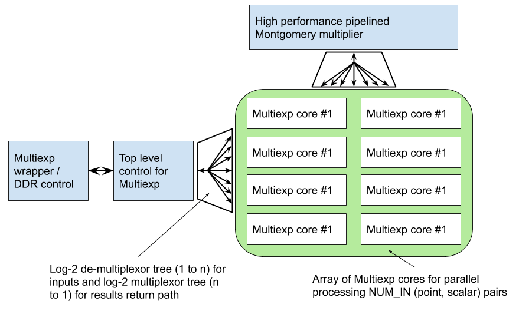
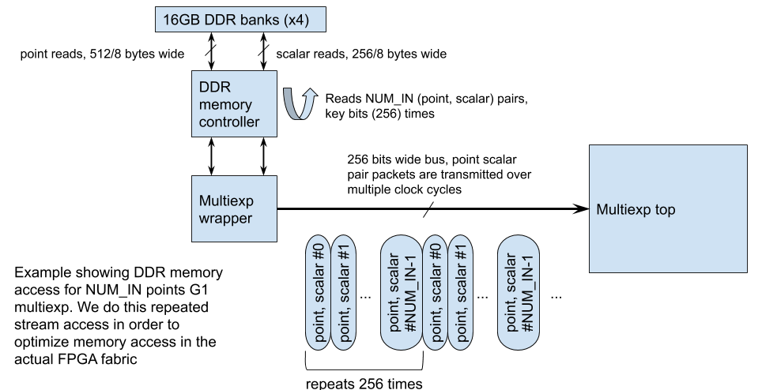
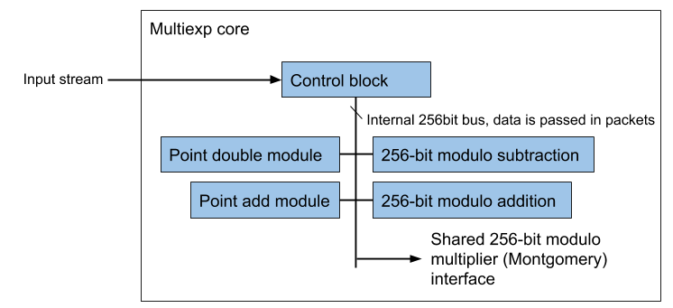

Multi-exponentiation in G1 
======================

 ## Architecture ##

The top level architecture consists of control logic and log-n (we selected  n = 2) multiplexors and de-multiplexors for evenly distributing the input stream of data across the array of multiexp cores. Once each core has computed its result (a subset of the multiexp result), the points are collapsed within the core array into a single final result which is loaded back into DDR memory and can be read by the host. The algorithm used does not pre-compute as this was require too much memory on the FPGA. We use a batched method to calculate the multi-exponentiation which takes on average KEY_BITS (256) * NUM_IN iterations. This can be broken down into KEY_BITS point doubles and (KEY_BITS * NUM_IN * 0.5) point adds. Currently the number of cores needs to be a power of two.

Each core operates on a subset of the inputs (Montgomery form Jacobian coordinates and scalar pairs), and the inputs are read in a streaming loop. This means the DDR reads are done back to back and will read in bursts all the input points for each bit in the 256 scalar. Note this does not create a bottle neck in the system due to the actual point operations taking longer than the DDR read.

Internally each core has a module that can perform point doubling, point addition, and a dedicated modulo adder and modulo subtractor.

For example if the kernel has been compiled with 16 cores, then each core will get 1/16 of the total inputs. After each core has its final result, they are collapsed into each other log2 - so in the case of 16 cores there would be another 4 stages of point addition done before the final Montgomery form Jacobian coordinate point is streamed back to host.

The multiplier architecture can handle about 16 cores before it starts to backpressure and lower performance.

## Area utilization ##

The kernel was able to operate at 250MHz with 8 cores. The top level (including multiplier and kernel glue logic) used the following resources:

| FF |  LUT | DSP| 
| --- | --- | --- |
| 258149 (10.92%) | 187660 (15.87%) | 480 (7.02%) |

Each multiexp core uses:

| FF |  LUT |  
| --- | --- | 
| 19221 (0.81% | 16294 (1.38%) |

## Performance ##

The measured performance of the kernel with 8 cores to performance a multi-exponentiation in G1 over 2^20 points and randomly generated scalars was 34s, 30.149K op/s, or 3.769K op/s/core. 
