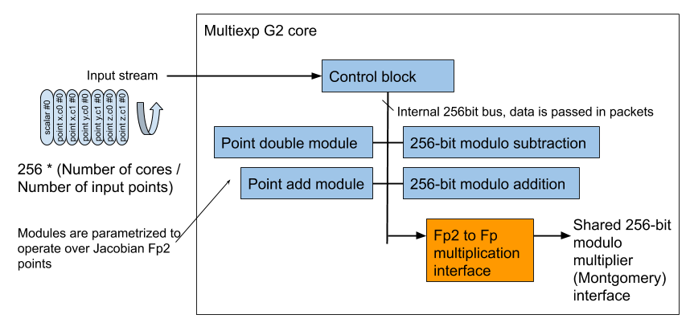

Multi-exponentiation in G2
======================
Please refer to the multiexp_g1 architecture description as the multiexp_g2 kernel is very similar. The only difference is packet data passed around is twice as big (for c0 and c1 coefficients), and the multiplier block has an extra interface block to convert the fe2 multiplications into fe1 multiplications.  Currently the number of cores needs to be a power of two.

## Area utilization ##

The kernel was able to operate at 250MHz with 8 cores. The top level (including multiplier and kernel glue logic) used the following resources:

| FF |  LUT | DSP| 
| --- | --- | --- |
| 379269 (16.04%) | 267207 (22.60%) | 480 (7.02%) |

Each multiexp core uses:

| FF |  LUT |  
| --- | --- | 
| 34310 (1.45%) | 25876 (2.19%) |

## Performance ##